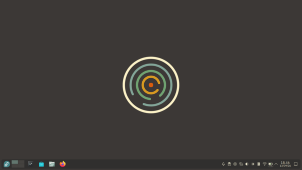
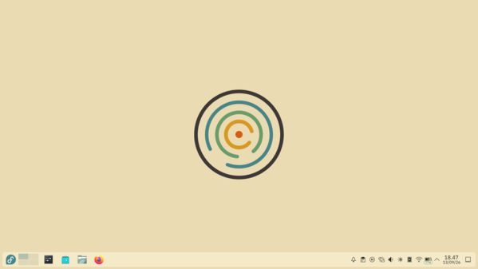

# Plasma Groovbx

A Gruvbox-colored Global Theme for KDE Plasma 6 — Breeze's look and feel, kept
stock (icon style, layout, window decorations), with the color scheme, accent,
icons, and wallpaper swapped for [Gruvbox](https://github.com/morhetz/gruvbox).

## Screenshots

| Dark | Light |
|---|---|
|  |  |

Wallpaper — *Circularities*, by Anifyuli:

| Dark | Light |
|---|---|
|  |  |

## Components

| Component | Location | Installs to |
|---|---|---|
| Color schemes (Dark/Light) | `color-schemes/` | `~/.local/share/color-schemes/` |
| Plasma style | `plasma/desktoptheme/` | `~/.local/share/plasma/desktoptheme/` |
| Global Theme (Dark/Light) | `plasma/look-and-feel/` | `~/.local/share/plasma/look-and-feel/` |
| Icons (Dark/Light) | `icons/` | `~/.local/share/icons/` |
| Wallpaper | `wallpaper/` | `~/.local/share/wallpapers/` |

Each piece works on its own — the color schemes work with the default Breeze
icon theme, the icon theme works with any color scheme, etc. The Global
Theme entries just tie the matching set together and switch to it in one go
(picking the right icon theme for the mode automatically, same as stock
Breeze/Breeze Dark).

## Install

Copy each folder under its component to the matching path in
`~/.local/share/`, e.g.:

```sh
cp -r color-schemes/* ~/.local/share/color-schemes/
cp -r plasma/desktoptheme/* ~/.local/share/plasma/desktoptheme/
cp -r plasma/look-and-feel/* ~/.local/share/plasma/look-and-feel/
cp -r icons/* ~/.local/share/icons/
cp -r wallpaper/* ~/.local/share/wallpapers/
```

Then apply from System Settings → Appearance → Global Themes → **Plasma
Groovbx Dark** or **Plasma Groovbx Light**.

## Icons

The icon theme is Breeze plus:
- The third-party app icons (LibreOffice, and others) that upstream Breeze
  [removed](https://invent.kde.org/frameworks/breeze-icons/-/merge_requests/477),
  restored at their original branding.
- KDE's own app icons and the relevant System Settings icons re-tinted to
  the Gruvbox palette.
- Folder and generic UI icons follow the accent color automatically (Breeze's
  own `ColorScheme-Accent` mechanism), no separate icon work needed there.

## GTK apps

GTK3/4 apps are themed automatically by Plasma's own GTK Config integration
(same as with any KDE color scheme) — nothing in this repo is required for
that. `gtk/` in this repo is a couple of extra, optional files (not part of
the installed theme, not referenced by any of the components above):

- `gtk/gtk.css.append` — a small snippet some people may want to brighten the
  GTK titlebar close-button hover color; append it to your own
  `~/.config/gtk-3.0/gtk.css` / `gtk-4.0/gtk.css` if you want it.
- `gtk/fix-window-buttons.sh` — a workaround for a `kde-gtk-config` bug
  (reproduces with 100% stock Breeze, unrelated to this theme) where GTK
  window buttons render blank. Only needed if you hit that specific bug.

## License

GPL-3.0-or-later, except the Plasma style (`plasma/desktoptheme/`), inherited
as LGPL from Breeze.
